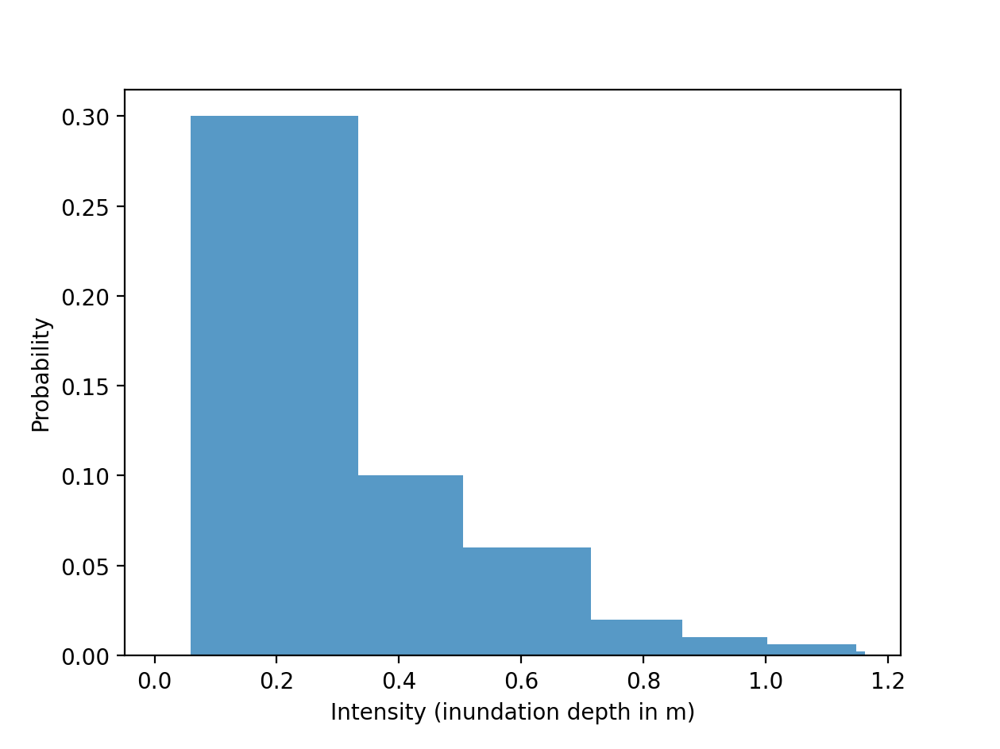
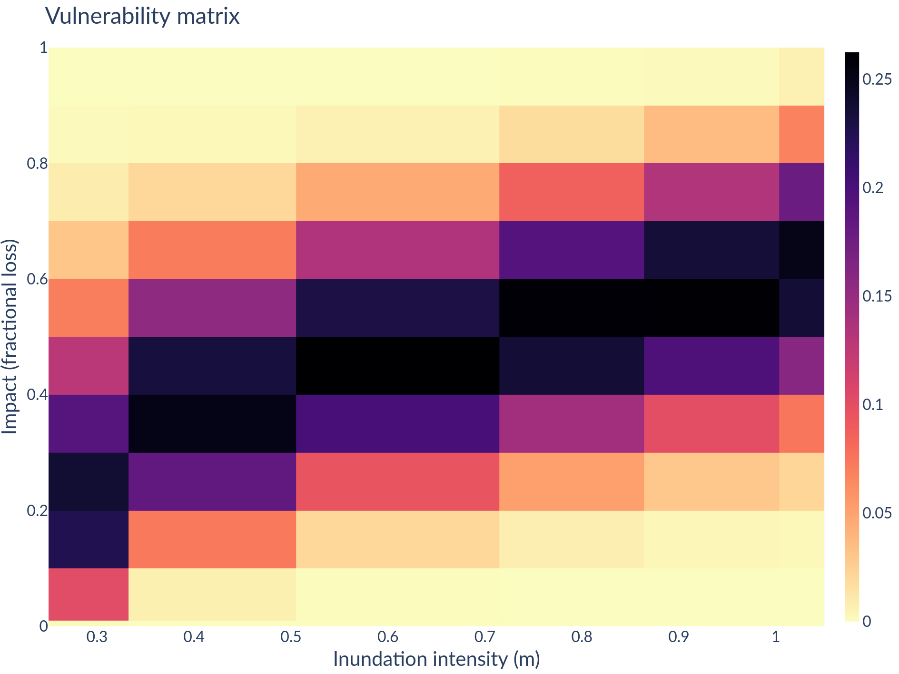

Onboarding a new model/data
===========================

Exceedance curves 
-----------------

The starting point of the calculation is a curve of hazard event intensities, obtained at the location of one particular asset. The probability of occurrence is given either by the 'return period' or an 'exceedance probability'. The return period is the average time in years between occurrences of an event that exceeds a given intensity. The exceedance probability is the probability that in a year an event occurs that exceeds the given intensity. Exceedance probability is the reciprocal of the return period. 

.. image:: onboarding/return_periods.png
  :width: 500
  
.. image:: onboarding/exceedance_curve.png
  :width: 500

Probability bins can be obtained from the exceedance curve, by subtracting one cumulative probability from another.

Note that in this case - which is the standard case - linear interpolation between points of the exceedance curve is assumed which corresponds to flat probability density within a bin.

In code this can be done using the :code:`ExceedanceCurve`:
::
  exceedance_curve = ExceedanceCurve(1.0 / return_periods, event_intensities)
  intensity_bins, probs = exceedance_curve.get_probability_bins()
  
Vulnerability/Event Model 
-------------------------
In general a Vulnerability/Event Model is responsible for obtaining for a particular asset instances of: 

#. :code:`HazardEventDistrib` that provides probabilities of hazard event intensentities for the asset, and
#. :code:`VulnerabilityDistrib` that provides conditional probabilities that given a hazard event of given intensity has occurred, a damage/disruption of a given level will occur.

The damage or disruption is sometimes referred to as the 'impact'.

The current implementation is non-parametric and based on discete bins - although continuous versions of :code:`HazardEventDistrib`/:code:`VulnerabilityDistrib` could certainly be added, based on particular parametric distributions.
 
:code:`HazardEventDistrib` is in this non-parametric version a histogram of hazard event intensities: defines a set of intensity bins and the annual probability of occurrence.

:code:`VulnerabilityDistrib` is a matix that provides the probability that if an event occurs with intensity falling in a particular intensity bin, an impact in a particular impact bin occurs.

The Vulnerability/Event Model (henceforth 'model') is in general responsible for
* Defining its hazard event data requirements by implementing method :code:`get_event_data_requests`
* Using the data to construct instances of :code:`HazardEventDistrib` and :code:`VulnerabilityDistrib` that will be used in the impact calculation. This is done by implementing method :code:`get_distributions`

:code:`HazardEventDistrib` and :code:`VulnerabilityDistrib` can be constructed in a single method to ensure their alignment, although this is method is probably only required in most bespoke cases. :code:`get_event_data_requests` is done as a separate step for performance reasons: it is desirable that all models state their data requirements 'up-front' in order that requests can be batched for fast retrieval. 

The model applies to:
* A type of hazard event (Inundation, Wildfire, Drought, etc)
* A type of asset (residential property, power generating asset, etc)
Decorators are used to 'tag' a model, so that an appropriate model can be selected for a given asset and hazard type; configuration allows types of :code:`Model` to be used in preference to other candidates. 

Specific types of model also exist for common modelling approaches. In particular, although in general it is desirable that a model has the flexibility to define its hazard event distribution and vulnerability distribution, in many cases the former will be sourced directly from a data set and it only remains to define the vulnerability distribution. The :code:`Model` class allows the general form of the Model to be implemented. The :code:`VulnerabilityModel` class is for cases where only the vulnerability is to be specified.

On-boarding a model based on a damage/disruption curve
------------------------------------------------------

A vulnerability distribition can be inferred directly from a damage/disruption curve: 

.. image:: onboarding/disruption_curve.png
  :width: 500

.. image:: onboarding/vulnerability_curve.png
  :width: 500

This approach is generally not recommended as it implies that damage/disruption in the event of an event occurs certainly with the given level.

Note that here the impact bins are inferred from the event intensity bins by interpolating the curve. The resulting impact bins have constant probability density or linear exceedance.

On-boarding a model based on a damage/disruption curve with uncertainty
-----------------------------------------------------------------------

In some cases, even if a full vulnerability matrix is unavailable, an estimate of the spread around a mean damage/disruption might be provided:

.. image:: onboarding/damage_with_uncertainty.png
  :width: 500
source: Huizinga et al. 'Global flood depth-damage functions: methodology and the database with guidelines' 
 
In such cases :code:`VulnerabilityModel` can be used to specify the close-formed conditional probability distribution to be used for a given intensity level. The cumulative probability density function is expected, and is provided via an :code:`ImpactCurve` by implementing method :code:`get_impact_curve`. 

Example models are provided to illustrate this. A model that uses beta distributions to provide a distribution yields the following :code:`VulnerabilityDistrib` in the above case:

  
Note that a beta distribution is a commonly-used heuristic; its functional form is convenient for vulnerability distributions although there appears to be limited justification for its use beyond providing a convenient means to apply uncertainty to a vulnerability distribution.
  

