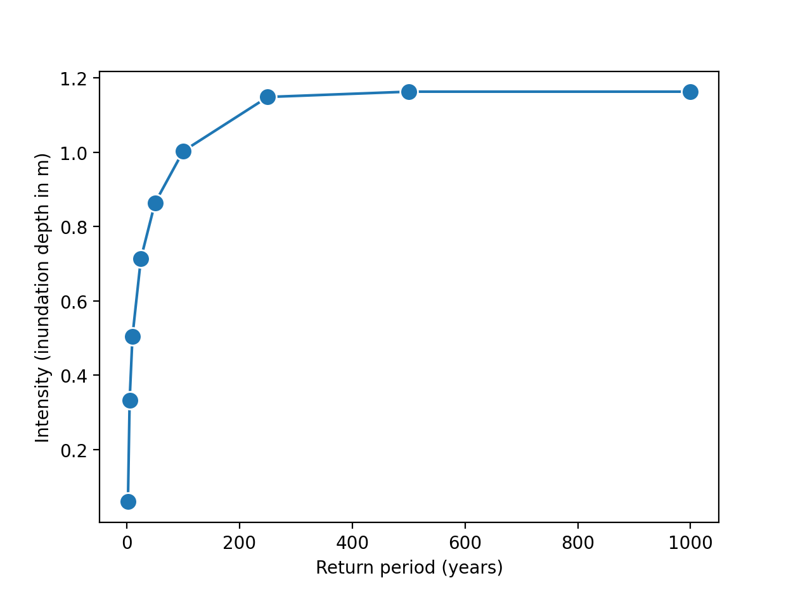
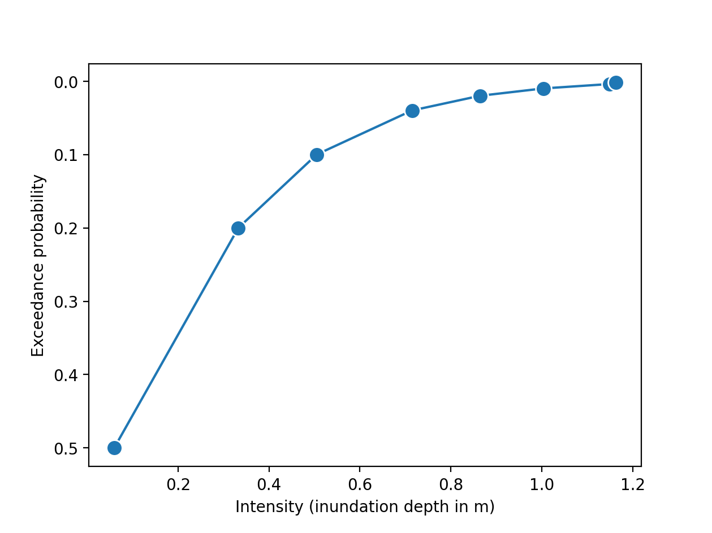
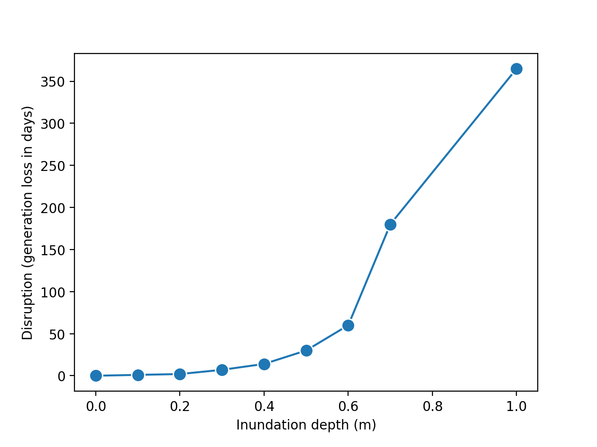
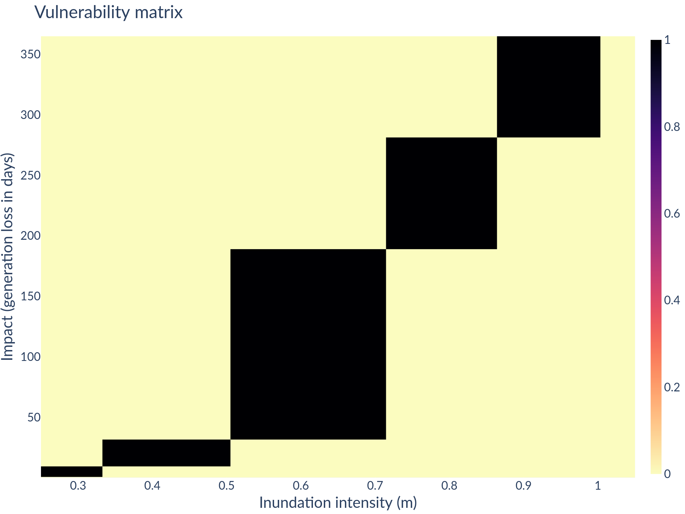
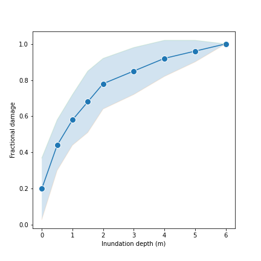

Onboarding a new model/data
===========================

Exceedance curves 
-----------------

A curve of hazard event intensities is obtained at the location of one partcular asset. The
probability of occurrence is either a 'return period' or an 'exceedance probability' (the reciprocal
of the return period).

  

Probability bins can then be obtained from the exceedance curve, by subtracting one cumulative probability from another.

On-boarding a model based on a damage/disruption curve
------------------------------------------------------

On-boarding a model based on a damage/disruption curve with uncertainty
-----------------------------------------------------------------------

  
Include some code
::
  import math
