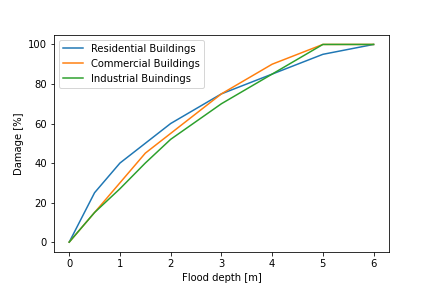

================================
Coastal floods
==================================

Introduction
-----------------

Currently, approximately one-third of the EU population resides within
50 km of the coast. Over this century, extreme sea levels in Europe are
projected to rise by one meter or possibly more. Presently, damages from
coastal flooding in the EU and UK amount to 1.4 €billion annually,
approximately 0.01% of the combined GDP of the EU and UK. Nearly half of
these damages are distributed between the UK (0.4 €billion annually) and
France (0.2 €billion annually). Each year, around 100,000 people in the
EU and UK face exposure to coastal flooding. Considering the current
level of coastal protection, damages from coastal flooding are expected
to increase considerably due to global warming for all EU countries with
a coastline. By 2100, annual damages are projected to reach 239 €billion
(equivalent to 0.52% of the projected GDP for EU+UK in 2100) under a
high emissions scenario and 111 €billion (0.24% GDP) under a moderate
mitigation scenario, following the 2015 Ageing Report’s socioeconomic
development. Among the countries, Germany, Denmark, France, Italy, the
Netherlands, and the UK would face the highest absolute damages. For
some nations, such as Cyprus, Greece, and Denmark, the damages represent
a substantial portion of their future national GDP, amounting to 4.9%,
3.2%, and 2.5%, respectively, by 2100 under high emissions. Given the
information presented above, conducting an efficient climate risk
assessment is of utmost importance to effectively mitigate the coastal
flood risk `JRC
report <https://joint-research-centre.ec.europa.eu/system/files/2020-05/pesetaiv_task_6_coastal_final_report.pdf>`__.

Physical climate risk models typically consist of three main components:
a hazard module, an exposure module, and a vulnerability module. This
model structure is widely accepted in the literature on this topic, and
coastal flood events are no exception. The hazard module includes
information about the specific hazards that we want to consider in our
model, along with their fundamental characteristics. In our case, it
will contain specific information about flood events that we will
discuss further on. Let us stress that in the hazard module, we do not
refer to any group of assets yet. Instead, we focus on the hazard events
themselves. The exposure component includes information about the
assets, including their descriptions and specific locations. Finally,
the vulnerability component serves as a connection between hazard,
exposure, and loss, allowing for the estimation of the relative damage
to an asset based on a specific hazard level. The core of the
vulnerability model is usually given by the so-called damage functions,
which translate the flood intensity into an estimated damage as a ratio
of the total value of the asset.

In the following, we will analyze each of the above components of the
physical risk model in the context of river floods and demonstrate how
to conduct a risk assessment for coastal flood events.

Hazard module
------------------

What are coastal floods ? 
==============================

Coastal flooding occurs when previously dry, often low-lying land is
submerged by seawater. This phenomenon is caused by rising sea levels,
leading to the overflow of water onto the land. The most common
mechanisms by which coastal flooding occurs are:

-  Direct flooding: This happens when the land is situated at a lower
   elevation than the sea level, and natural barriers such as dunes have
   not been formed by waves.

-  Water spilling over a barrier: During storms or high tides, when
   water levels exceed the height of a barrier, the water spills over to
   the other side, causing flooding. These barriers can be natural, like
   dunes, or artificial, such as dams.

-  Water breaching a barrier: In this case, powerful waves, typically
   during severe weather events, break through barriers, leading to
   their destruction or partial collapse. These barriers can be either
   natural or artificial.

Coastal flooding may result from a wide range of factors, some of them
including:

-  Land elevation above sea level: The height of the land in relation to
   the sea level plays a significant role in determining the
   vulnerability to flooding. Areas with low elevation are more prone to
   flooding, especially during high tides or storm events.

-  Erosion and subsidence: Erosion refers to the wearing away of
   materials by natural forces like waves, wind, or water, which can
   lead to the reduction of land area. Subsidence occurs when the ground
   sinks or moves underground, which can also contribute to increased
   flood risk.

-  Vegetation removal: The removal of vegetation can reduce the natural
   processes of infiltration and interception, causing more water to run
   off and increase the risk of flooding, as the water reaches river
   channels more rapidly.

-  Storm surges: Coastal flooding is often triggered by storm surges,
   which are temporary increases in sea levels caused by events like
   tsunamis or cyclones. A storm surge is measured by the water level
   that exceeds the normal tidal level, excluding waves.

In the following discussion, we will focus on the storm surge level as
it is the primary factor contributing to coastal floods.

Coastal flood datasets
========================================

There are two main approaches to the risk assessment of catastrophe
events, particularly for floods. The first approach, sometimes called
the probabilistic one, involves estimating the probability of flood
events of different intensities and then translating this intensity into
potential damage using the vulnerability component. The second approach,
known as the "event-based" or deterministic approach, simulates
thousands of potential flood events and estimates the flood peril based
on this collection of events. Creating this collection of events can be
achieved using climate models or stochastic analysis based on past
historical events. In our approach, we will rely on the probabilistic
approach, and the remainder of this document will focus entirely on this
methodology.

The choice of the risk assessment method dictates the datasets we rely
on. In the event-based approach, the hazard dataset consists of a
collection of thousands of simulated events that can be used in flood
risk analysis. These datasets are often presented in the form of
event-loss tables. On the other hand, the probabilistic approach mainly
involves working with return period maps of flood events. A return
period map provides information about the likelihood of a flood event of
a given intensity occurring at various locations on a map.

The area that is affected by a flood event is called a flood footprint.
The map displaying the flood footprint is provided with a specific
resolution, which is a crucial measure of the dataset’s accuracy. Return
period maps, used to indicate the intensity and frequency of flood
events, can be created based on historical climate parameters or in
scenario versions that consider various possibilities of climate change.

In practice, we typically require a collection of return period maps for
different return periods to perform a comprehensive risk estimation.

Coastal flood indicators - storm surges 
========================================

Storm surges, also known as meteorological residuals or meteorological
tide, are among the primary components contributing to extreme water
levels along coastal zones, along with waves and tidal oscillations.
Storm surges result from the combined effects of wind-driven water
circulation toward or away from the coast and changes in water level
induced by atmospheric pressure, known as the inverse barometric effect.
The magnitude of a storm surge depends on various factors, including the
size, track, speed, and intensity of the storm system, local nearshore
bathymetry (water depth), and the configuration of the coastline.

Despite the pressing need to prepare for expected changes in extreme
water levels in Europe, there remains limited, if any, information on
projections of Storm Surge Levels (SSL) under the Representative
Concentration Pathways (RCPs). In light of this context, the study
referenced in `JRC
report <https://joint-research-centre.ec.europa.eu/system/files/2020-05/pesetaiv_task_6_coastal_final_report.pdf>`__
employed a hydrodynamic
model driven by wind and pressure fields from CMIP5 climate models to
produce projections of extreme storm surge levels (SSL) along the
European coastline. In the following, we will provide a brief analysis
of how such projections can be conducted based on the findings of this
paper.

The process of creating a storm surge hazard dataset typically involves
the following steps:

-  Choose a hydrological model to simulate storm surge levels.

-  Validate the model by running a hindcast run of simulations and
   comparing it to historical observations.

-  Conduct storm surge simulations for a selected future time interval.

-  Perform extreme value analysis to generate return period maps.

Below we will discuss each of these steps in detail.

Construction of return period maps for SSL 
================================================

Hydrological model selection and setup 
~~~~~~~~~~~~~~~~~~~~~~~~~~~~~~~~~~~~~~~

To simulate storm surge levels, researchers commonly employ either
open-source or commercial hydrological models. An example of such a
model is the Delft3D-Flow module, which is part of the open-source
Delft3D modeling framework. Setting up the model usually involves
finding a balance between data quality, model stability, and
computational efficiency. For instance, in a study referenced in
`JRC
report <https://joint-research-centre.ec.europa.eu/system/files/2020-05/pesetaiv_task_6_coastal_final_report.pdf>`__
, water level model outputs were
generated at 3-hour intervals and sampled every 25 kilometers along the
coastline.

Model validation
========================================

The first step involves assessing the model’s performance, which means
evaluating how effectively the model can simulate storm surges based on
input climate conditions. To validate the model, it is common practice
to conduct a hindcast run (i.e. retrospective historical climate
simulation) of storm surge levels during a specific past time period.
The model’s simulated storm surge data is then compared to observed
time-series data of storm surge levels from available climate databases.
For example, in a study referenced in `JRC
report <https://joint-research-centre.ec.europa.eu/system/files/2020-05/pesetaiv_task_6_coastal_final_report.pdf>`__, a
hindcast run was carried out spanning from 01/01/1979 to 01/06/2014.
This run used

-  hindcast atmospheric pressure,

-  hindcast wind fields

obtained from the `ERA-Interim
database <https://www.ecmwf.int/en/forecasts/dataset/ecmwf-reanalysis-interim>`__.
Let us recall, that ERA-Interim is a global atmospheric reanalysis from
1979, continuously updated in real time (it’s successor is the ERA5
reanalysis from the Copernicus Climate Change Service).

The resulting storm surge values were subsequently validated by
comparing them to water level time series data available from the `JRC
Sea Level Database <http://webcritech.jrc.ec.europa.eu/SeaLevelsDb>`__ .
The temporal resolution of the actual historical measurements is
typically in the order of few hours and the temporal extent of the
validation dataset usually varies among stations.

In the following step, tidal harmonic analysis is usually utilized to
calculate the residual storm surge water levels, represented as
:math:`\eta_s`. In this context, ’residual storm surge level’ refers to
the disparity between the observed water level during a storm event and
the water level expected solely from astronomical tide predictions.
Afterwards, the historical storm surge observations are directly
juxtaposed with the model output and assessed using the root mean square
error (RMSE):

.. math:: RMSE= \sqrt{    \frac{\sum_{i}^n (\eta^i_{s,measured}-\eta^i_{s,model} )^2  }{n}   }

and relative RMSE error (%RMSE)

.. math:: \% RMSE=   \frac{ RMSE  }{ max(\eta_{s,measured}) } \times 100.

where :math:`n` is the number of measurements in the storm surge time
series at a given location.

Agreement in terms of the probability density function of the values can
be assessed by means of the Kolmogorov–Smirnov test.

SSL simulations for different climate scenarios 
~~~~~~~~~~~~~~~~~~~~~~~~~~~~~~~~~~~~~~~~~~~~~~~~

After validating the model and confirming its ability to accurately
reproduce storm surge levels, we can employ it for simulating future
SSL. Note that in the historical scenario, it is sufficient to conduct
statistical analysis on the hindcast run (let’s say the last 50 years),
as no climate change assumption presumes that future climate conditions
will be the same as those in the past.

Another important aspect to note is that information about the specific
climate projection (e.g. RCP) is typically included in the input data
(in this case atmospheric pressure and wind fields) for the hydrological
model, rather than in the hydrological model itself. The input to the
model simulating Storm Surge Levels (SSL) usually comprises hindcast or
future simulated data from various climate models.

The example of SSL simulations using Delft3D model is discussed in
`JRC
report <https://joint-research-centre.ec.europa.eu/system/files/2020-05/pesetaiv_task_6_coastal_final_report.pdf>`__
. In this work the period 1970-2000 was
considered as baseline period, while 2010-2040 and 2070-2100 were
considered as the short and long term future scenarios for RCP4.5 and
RCP8.5, respectively. The two time slices will be mentioned as 2040 and
2100 hereinafter for reasons of brevity (e.g. RCP8.5\ :math:`_{2040}`).

The model was forced by the 6-h output of 8 climate models available at
the CMIP5 database:

-  ACCESS1-0 (CSIRO-BOM Australia),

-  ACCESS1-3 (CSIRO-BOM Australia),

-  CSIRO-Mk3.6.0 (CSIRO-QCCCE, Australia),

-  EC-EARTH (EC-EARTH consortium),

-  GFDL-ESM2M (NOAA Geophysical Fluid Dynamics Laboratory USA),

-  HadGEM2-CC (Met Office Hadley Centre UK),

-  MPI-ESM-LR (Max-Planck-Institut für Meteorologie Germany)

-  MPI-ESM-MR (Max-Planck-Institut für Meteorologie Germany).

For better analysis of the model performance and the storm surge
scenarios, the European coastal zone was divided into 10 regions on the
grounds of the geographical and physical setting: Black Sea, East,
Central and West Mediterranean, South- and North-North Atlantic, Bay of
Biscay, as well as North, Baltic and Norwegian Sea

Extreme value statistical analysis
~~~~~~~~~~~~~~~~~~~~~~~~~~~~~~~~~~

In the subsequent step, the tools of extreme value theory are employed
to extract return periods from simulations conducted earlier. Let’s
analyze this process again using the datasets derived in
`JRC
report <https://joint-research-centre.ec.europa.eu/system/files/2020-05/pesetaiv_task_6_coastal_final_report.pdf>`__
as an example.

In this work the peak-over threshold (POT) approach was applied to
identify extreme events for each 30-year time slice, according to a
certain SSL threshold parameter :math:`u`. Let us recall that the POT
approach is a statistical technique used in extreme value theory (EVT)
to analyze and model the tail of a probability distribution,
particularly focusing on extreme values that exceed a certain threshold.
Given that the peaks need to be independent
observations and not the result of the same extreme event, it is common
to apply de-clustering of events using a minimum time difference between
peaks varying from 34 h to 5 days.

The selected exceedance events per year were pooled and modelled
according to the Generalized Pareto Distribution (GPD):

.. math::

   F(y)=
   \left\{\begin{split}
   1- \Big( 1+\frac{\xi_y}{\sigma}  \Big)^{ \frac{-1}{\xi}  }, \quad \xi\neq 0, y>0,  \\
   1+\exp( \frac{-y}{\sigma}  ),  \qquad \xi= 0, y>0. \\ 
   \end{split}\right.

where :math:`y` is the time-series of SSL above the threshold :math:`u`
such as :math:`y = \eta_s-u`, :math:`\sigma` is the scale parameter and
:math:`\xi` is the shape parameter. The scale parameter :math:`\sigma`
of the GPD is related with the scale parameter :math:`\psi` and the
location parameter :math:`\mu` of the generalized extreme value
distribution according to:

.. math:: \sigma=\psi+\xi(u-\mu).

The parameters of the GPD are estimated using the maximum likelihood
method and subsequently the :math:`N`-year return SSL is estimated as
follows

.. math::

   \eta_{s,N}=
   \left\{\begin{split}
   u+\frac{\sigma}{\xi} [ (Nn_y\zeta_u)^\xi-1 ] , \quad \xi\neq 0,  \\
   u+ \sigma\log(Nn_y\zeta_u) ,  \qquad \xi= 0, \\ 
   \end{split}\right.

where :math:`n_y` is the number of annual exceedances per year in each
time slice and :math:`\zeta_u` the probability that an empirical value
exceeds the threshold :math:`u`. Extreme SSL values were calculated for
different return periods and :math:`T_r  = [5, 10, 50, 100]` years are
discussed in :cite:`JRC-coastal`.

Exposure module 
--------------------------

Exposure refers to the collection of assets that are susceptible to
potential hazards. The exposure model encompasses data regarding the
assets, properties, and infrastructure, along with their vulnerability
to potential risks. This information serves as a vital input for the
catastrophe model. In practical applications, an exposure database
typically includes the following information:

-  Type of assets (e.g., buildings, infrastructure, agriculture,
   machines, etc.)

-  Location of assets (usually specified in terms of latitude and
   longitude)

-  Value of the assets

Figure `1 <powerplants_exp_>`_ provides a visualization of an
illustrative portfolio consisting of power plants in Spain.

.. _powerplants_exp:

.. figure:: ../images/coastal_flood/exposure2.png
   :align: center
   :width: 100.0%

   Figure 1: Power plants in Spain, with the energy production serving as a proxy
   for the power plant’s value. The value in USD does not correspond to
   the actual energy production value but is used to illustrate the
   differences in energy production between the power plants in the
   dataset.

The complexity of the exposure component varies depending on the
specific use case. When conducting risk assessment on a macroeconomic
level, such as for a country or region, estimating exposure can be
challenging due to the need for a comprehensive information about
economic properties and services. However, when assessing a portfolio of
assets for a company or bank, the exposure part typically presents fewer
difficulties. It comes from the fact that companies generally possess
detailed information about their assets, which serves as a primary input
for our climate risk model.

Let us stress that the coastal zone holds significant importance, with
over 200 million European citizens residing in its proximity, spanning
from the North-East Atlantic and the Baltic to the Mediterranean and
Black Sea. Current trends suggest a continued migration towards coastal
areas. These regions not only accommodate essential commercial
activities but also support diverse ecosystems that offer vital habitats
and food sources. However, coastal zones face heightened vulnerability
to climate change due to rising sea levels and potential changes in
storm frequency and intensity. Global mean sea level has risen by 13-20
cm since pre-industrial times, with an acceleration observed since the
1990s. This amplifies the risk of coastal floods, potentially exposing
more areas to such hazards.

Information regarding global exposure to coastal floods, categorized by
countries, can be found, for instance, at:
`https://www.marshmclennan.com <https://www.marshmclennan.com/insights/publications/2021/september/marsh-mclennan-flood-risk-index.html>`__

Vulnerability module 
------------------------------

While the hazard module focuses on the hazard events themselves, the
vulnerability module’s purpose is to translate the intensity of a hazard
into the damage incurred by exposed assets. This damage is typically
quantified using various metrics, such as the damage ratio, and is
heavily influenced by both hazard and exposure characteristics. As a
result, the vulnerability module relies on the outputs of the hazard and
exposure modules, with the hazard and exposure data serving as inputs
for vulnerability assessments.

A key concept within the vulnerability module is the use of damage
functions, which quantify the impact of hazard intensity on specific
assets :cite:`Mitchel`. This framework can be applied
effectively to flood events.

Assessing the potential damage caused by floods is a critical component
of flood risk management. To estimate direct flood damage, depth-damage
curves are commonly employed. These curves provide insights into the
expected flood damage for specific water depths, categorized by asset
types or land-use classes. Figure `2 <fig-damage1_>`_ provides an illustration of a
damage function for residential, commercial, and industrial buildings
exposed to floods, sourced from the Joint Research Centre under the
European Commission. The dataset containing this damage function can be
downloaded from the Joint Research Centre repository
:cite:`Houz`.

The plots in Figure `2 <fig-damage1_>`_ demonstrate how flood
intensity, represented by flood depth, translates into potential damage
for different building types. As flood depth increases, so does the
expected damage, with all building types reaching 100% damage at
approximately 6 meters of flood depth.

Though several countries have created flood damage models using
historical flood data and expert input, the lack of comprehensive
depth-damage curves across all regions poses a challenge. Additionally,
variations in methodologies employed by different countries for damage
modeling make direct comparisons difficult and limit the feasibility of
supra-national flood damage assessments :cite:`Houz`.

.. _fig-damage1: 

   Figure 2: The plots show the relationship between flood depth and the
   corresponding damage factor, ranging from 0% to 100%, for three types
   of assets: residential buildings, commercial buildings, and
   industrial buildings. In all cases, the damage reaches 100% when the
   flood depth approaches approximately 6 meters.

Impact assessment 
--------------------------

After collecting all the necessary components of hazard, exposure, and
vulnerability, we proceed with the most important part, which is risk
assessment. We usually follow these steps. First, we use the return
period maps to determine the flood intensity associated with each
location of the area of interest. Next, we map the flood intensities
data onto the exposure map to identify the specific flood hazard level
that each asset faces. Then, we estimate the potential damage to each
asset by applying the appropriate damage function, which quantifies the
relationship between flood intensity and asset vulnerability. By
utilizing these functions, we can calculate the expected level of damage
or loss for each asset based on the corresponding flood intensity.

Once the asset damage estimates are obtained, we aggregate and analyze
the results to gain an overall assessment of the risk. This involves
summarizing the estimated damages for all exposed assets, calculating
the total expected losses, and identifying areas or assets that are at
higher risk. The final output of the risk assessment is usually provided
in a form of risk metrics that provide information about the risk
related to the portfolio of assets. Common metrics include
:cite:`Mitchel`:

-  Annual Expected Loss (AEL).

-  | Standard deviation (SD) around the AEL
   | SD is a measure of the volatility of loss around the AAL.

-  | Occurrence Exceedance Probability (OEP).
   | OEP is the probability that the maximum event loss in a year
     exceeds a given level.

-  | Aggregate Exceedance Probability (AEP).
   | AEP is the probability that the sum of event losses in a year
     exceeds a given level.

-  | Value at risk (VaR).
   | VaR is the loss value at a specific quantile of the relevant loss
     distribution.

Additionally, by considering factors such as asset valuation,
replacement costs, business interruption losses, and indirect expenses,
a more comprehensive estimation of the financial impact can be achieved.

Bibliography
---------------------------------

.. bibliography:: ../references.bib
