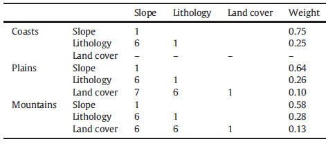
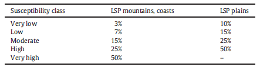

Introduction
------------------

A landslide is defined as the downward movement of rock, soil, or debris
along a slope due to gravity. They are typically categorized according
to the type of material involved, such as rock, debris, earth, or mud,
and the nature of the movement, including falls, topples, avalanches,
slides, flows, and spreads. The broader term ’landslide’ encompasses
various forms of mass movements like rock falls, mudslides, and debris
flows. Additionally, mudflows and debris flows resulting from volcanic
activity are specifically referred to as lahars
:cite:`ESDAC_landslides`.

Landslides are a recurring natural hazard in Europe, and each year, they
unleash a cascade of devastating consequences, ranging from loss of life
and injury to the destruction of homes, infrastructure, and valuable
land. The expanding footprint of urban developments and transportation
networks into hilly regions prone to landslides further compounds the
potential impact of these geological events. Landslides, however, are
not solely induced by prolonged or heavy rainfall; they can also be
triggered by a multitude of natural phenomena, including earthquakes,
floods, and volcanic eruptions, as well as by human activities,
construction projects, or a combination of these factors.

It is worth noting that landslides often incur much higher economic
losses and casualties than commonly acknowledged. When landslides
coincide with other major natural disasters, their effects may go
unnoticed by the media, leading to reduced awareness among both
authorities and the general public regarding the risks posed by
landslides.

In addition to their immediate effects, landslides can lead to
technological disasters in industrial or developed areas, resulting in
environmental pollution. Coastal zones and volcanic islands face the
additional threat of landslides triggering other natural hazards, such
as tsunamis. While landslides can directly cause significant damage
through mass movements, Europe has well-documented instances of
catastrophic flash floods caused by the sudden collapse of natural dams
formed by large landslides in narrow river valleys or by the impact of
landslides on artificial reservoirs. Additionally, the sliding and
collapse of mine waste dams contribute to the array of landslide-related
challenges faced by the continent.

Landslide susceptibility
---------------------------

Landslide susceptibility refers to the likelihood or probability of an
area being vulnerable to landslides or experiencing landslide events.
This measurement is commonly employed in geology, geotechnical
engineering, and hazard assessment to gauge the inherent risk of a
specific location or region to landslides. Susceptibility, in this
context, does not take into account the temporal likelihood of a
landslide occurrence (i.e., when or how frequently landslides happen) or
the potential magnitude of these events (i.e., their size or destructive
potential).

When evaluating landslide susceptibility on small scales (e.g., less
than 1:200,000) across large areas (such as entire nations or
continents), challenges arise due to generalization, limited spatial
data resolution, and incomplete landslide inventory information.

A Landslide Susceptibility Index (LSI) serves as a quantitative metric
for evaluating the probability or risk of landslides occurring in a
particular area. The following discussion will detail the process of
constructing this index.

Input to the LSI
----------------------

When constructing a landslide susceptibility index, it is essential to
incorporate a variety of data types to accurately assess the potential
risk and impact of landslides in a given area. Three crucial types of
data typically required for this purpose include terrain gradient data,
lithology data, and land cover data. Below is a coincise description of
each of them:

-  | **Terrain Gradient Data**
   | Terrain gradient data refers to the steepness or incline of the
     land surface. It’s a measure of how quickly elevation changes over
     a certain distance. Essentially, it describes the slope of the
     terrain. This data is usually expressed as a percentage or degree.
     A :math:`p`\ % gradient means that for every 100 units (like meters
     or feet) you move horizontally, the elevation changes by p units in
     the vertical direction. For example, a 100% gradient means a
     1-meter rise over a 1-meter horizontal distance, equivalent to a
     45-degree angle. Terrain gradient is crucial in many fields, as it
     affects soil erosion rates, water runoff, landslide susceptibility,
     and construction projects. It is typically derived from topographic
     maps or Digital Elevation Models (DEMs) using Geographic
     Information Systems (GIS) software.

-  | **Lithology Data**
   | Lithology data pertains to the physical characteristics of rocks or
     sediments in a given area. It describes the material composition,
     texture, and structure of the Earth’s crust. This data includes
     information about rock types (e.g., sandstone, granite, limestone)
     and their properties such as grain size, hardness, layering, and
     mineral composition. Lithology data is fundamental in understanding
     soil stability, groundwater flow, mineral resources, and potential
     hazards like landslides or sinkholes. It is usually obtained
     through field surveys, borehole data, geological maps, and
     sometimes remote sensing techniques.

-  | **Land Cover Data**
   | Land cover data describes the physical material at the surface of
     the earth. This includes vegetation, water bodies, artificial
     structures, and bare ground. The data categorizes areas based on
     what covers the ground (e.g., forests, grasslands, urban areas,
     lakes, rivers). It’s about the ’cover’ rather than the use of the
     land. Land cover data is used in environmental management, urban
     planning, agriculture, climate science, and biodiversity
     conservation. It is primarily gathered through satellite imagery
     and aerial photography, and analyzed using GIS software.
   | Each of these three parameters can be characterized by various
     internal classes. Segmenting into classes plays a crucial role in
     the later development of the LSI. Thus, we can identify the
     following distinct classes within each of the above mentioned
     parameters

   -  Slope classes: slope categories are typically defined according to
      intervals of gradient values. For example, one might create
      classes such that gradient value belong to 0-1, 1-3, 4-6, and so
      on.

   -  Lithology classes: for example, marl, volcanic rocks, detrital
      formations, crystalline rocks, etc.

   -  Land cover: for example cropland, open forest, bare ground,
      meadow, artificial surfaces, etc.

   The maps representing exemplary classes of slope, lithology, and land
   cover (taken from :cite:`Elsus2`) are presented in
   figures `1 <terrain_>`_, `2 <lithology_>`_, and `3 <landcover_>`_,
   respectively.

   .. _terrain:

   .. figure:: ../images/landslide/terrain.PNG
      :align: center
      :width: 80.0%

      Terrain gradient data classified into eight classes depending on
      the gradient value. Picture sourced from
      :cite:`Elsus2`.

   .. _lithology:

   .. figure:: ../images/landslide/lithology.PNG
      :align: center
      :width: 80.0%

      The IHME 1500 lithology information grouped into 19 classes.
      Picture sourced from :cite:`Elsus2`.

   .. _landcover:

   .. figure:: ../images/landslide/land_cover.PNG
      :align: center
      :width: 80.0%

      The land cover information derived from the global GlobCover data
      set reclassified into seven classes. Picture sourced from
      :cite:`Elsus2`.

.. _sec:weights:

Weights assignment
-----------------------

When considering the three parameters mentioned above as inputs to
landslide susceptibility index (LSI), it becomes necessary to assign
weights to these parameters based on their significance in LSI
construction. The weight tell us how big is the input of a given
parameter to LSI. These weights may vary significantly depending on the
type of region under consideration. Typically, three physiographical
regions (i.e. specific geographical areas characterized by its distinct
physical landscape and natural features) are considered:

-  coastal areas,

-  plains,

-  mountains,

although subgroups within these regional classes can also be
distinguished (for instance, in :cite:`Elsus`, the authors
divide mountains and plains depending on the climate zone in which they
are located). Each of these region types can be associated with
different weights for terrain gradient, lithology, and land cover
factors.

The process of assigning weights to specific parameters (such as slope,
lithology, and land cover) and their respective classes typically relies
on data from historical landslide occurrences. This data is collected in
specialized databases, like the one mentioned in
:cite:`Elsus` :cite:`Elsus2`. By analyzing the ground
characteristics where these landslides have occurred, it’s possible to
construct landslide frequency ratios for each parameter and class. Based
on these ratios, weights can then be assigned to the parameters and
their classes.

The information regarding the relative importance of parameters is
typically summarized in a pairwise comparison matrix, as shown in Figure
`4 <fig:comparison_matrix_>`_. In the pairwise comparisons, a value
between 9 (indicating that one parameter is extremely more important
than another) and 1 (indicating that both parameters are equally
important) can be assigned to each pair of parameters in the comparison
matrix. This is done by rating rows against columns. For example, when
comparing ’land cover’ to ’slope’ in the plains (assigned a value of 7),
we conclude that ’land cover’ is significantly more important than
’slope’ in this context. Conversely, when comparing ’land cover’ to
’lithology’ in the mountains (assigned a value of 6), we infer that
’land cover’ is also significantly more important than ’lithology,’
albeit to a slightly lesser degree than in the previous case.

.. _fig:comparison_matrix:

   Example of a comparison matrix from :cite:`Elsus`.
   Parameter weight assignment is done for the three physiographical
   regions: coasts, plains, mountains.

Landslide susceptability index and LSI maps
===========================================

Finally, with all this information, the LSI can be constructed using the
following formula:

.. math::
   :name: LSI-equation

   LSI = \sum^{n=3}_{j=1}w_j \times x_{ji}

where:

-  :math:`w_j` represents the weight of parameter :math:`j` (slope,
   lithology, land cover).

-  :math:`x_{ji}` represents the weight of parameter class :math:`i` in
   criterion :math:`j` (e.g. :math:`j`\ ="land cover" and
   :math:`i`\ ="cropland").

Both :math:`w_j` and :math:`x_{ji}` are constructed as described in `Section 4 <sec:weights_>`_. It is important to note that the index
above is not summed over :math:`i`, emphasizing the LSI’s dependence on
individual pixels on the map.

In the subsequent step, the obtained LSI values are categorized into
multiple classes. This classification is somewhat subjective and
influenced by various factors. For example, in
:cite:`Elsus`, the authors introduced five LSI classes:
’very low,’ ’low,’ ’moderate,’ ’high,’ and ’very high’. The rules of
this classification depending on LSI value are presented in Table
`5 <classification_>`_

.. _classification:

   Susceptibility classification for zone-specific index maps derived in
   :cite:`Elsus`.

The authors made the decision to assign the highest susceptibility class
exclusively to the physiographic regions of ’mountains’ and ’coasts,’ as
landslide intensity in these areas is expected to be significantly
higher than in ’plain’ areas. In the highest susceptibility class for
each model zone (’very high’ in ’mountains’ and ’coasts,’ ’high’ in
’plains’), approximately 50% of landslide-affected pixels (LSP) are
located, while in the lowest susceptibility classes (’very low’ in
’plains,’ ’low’ and ’very low’ in ’mountains’ and ’coasts,’
respectively), less than 10% of LSP occur (see Table
`5 <classification_>`_).

Let us stress that classification of landslide susceptibility is a
complex task, and there are currently no universally established rules
regarding the number of classes, their characteristics, or
specifications.

To sum up, the method for creating an LSI map can be summarized as
follows:

-  Select a pixel on the map.

-  The pixel is characterized by weights :math:`w_j` corresponding to
   the inputs of slope, lithology, and land cover for the LSI, as well
   as weights :math:`x_{ji}` that define the classes of these
   parameters.

-  Calculate the LSI for this pixel using the formula
   :eq:`LSI-equation`.

-  Classify the LSI value with respect to the chosen classification
   method.

-  Repeat the procedure for all pixels on the map.

An example of the LSI map derived in :cite:`Elsus` is
depicted in Figure `6 <LSImap_>`_.

.. _LSImap:

.. figure:: ../images/landslide/LSImap.PNG
   :align: center
   :width: 60.0%

   Classified European landslide susceptibility map derived in
   :cite:`Elsus`.

Bibliography
---------------------------------

.. bibliography:: ../references.bib
