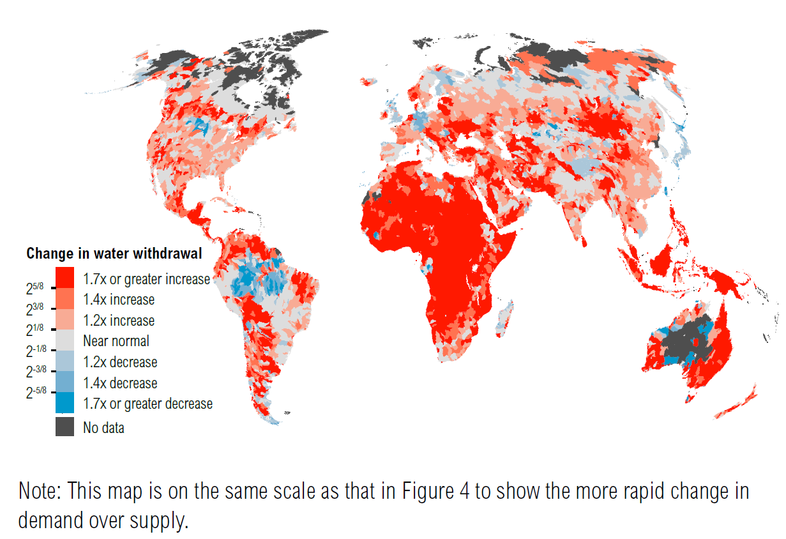
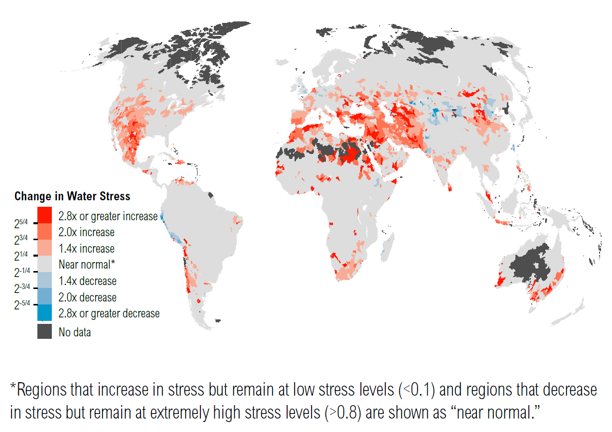

Introduction
---------------

Water stress occurs when the demand for water in a region surpasses the
available supply or when poor water quality limits its usability. It
serves as a measure of the strain on water resources. In numerous
regions across Europe, water stress has already become a prevailing
concern. Droughts and water shortages are no longer uncommon or extreme
occurrences in the continent. According to the EEA report
:cite:`EEA`, approximately 20% of European territory and 30%
of the European population experience water stress during an average
year. This issue is exacerbated by climate change, which leads to more
frequent, severe, and impactful droughts. Southern and south-western
Europe face particularly concerning trends, with the possibility of
river discharge decreasing by up to 40% during summer under a scenario
of a 3°C temperature rise.

This document outlines the methodology employed to generate global
assessments of water stress, water demand, water supply, and seasonal
variations for three 21-year periods centered around 2020, 2030, and
2040, as detailed in :cite:`First`. The dataset produced by
this publication contains significant information and finds application,
for example, in the calculation of ECB climate risk indicators.

Blue water
-----------------------

The concept of water stress is intrinsically linked to the concepts of
water demand and water supply, both of which we will explore further in
this paper. For now, it is important to note that our analysis primarily
revolves around the concept of "blue water", which refers to freshwater
present in rivers, lakes, reservoirs, and underground aquifers. This
visible water, integral to the landscape, plays a crucial role in the
Earth’s hydrological cycle. A significant aspect of blue water’s
dynamics is its relationship with runoff. Runoff is the process where
water, originating from precipitation, travels across the land’s surface
or through the soil, eventually contributing to the blue water in
rivers, lakes, and oceans.

Let us stress that we will make a distinction between "blue water" and
"available blue water". "Blue water" refers to the water in rivers,
lakes, and aquifers – essentially, the freshwater that is visible and
stored in the ground or on the surface. On other hand, "Available blue
water" is the amount of this water that’s actually available for use.
It’s calculated as the total flow-accumulated runoff (water from
precipitation that flows over the land surface and accumulates in bodies
of water) minus the consumptive use of water upstream. Here by
consumptive we mean the portion of water use that is not returned to the
water source and is lost due to processes like evaporation,
transpiration, or incorporation into products.

Water supply 
------------------

The water supply information relies on runoff data, which is obtained
from global circulation models accessible i.e. through CMIP data.

When addressing the issue of future water supplies one has to take into
account different scenarios of climate change. The typical approach
involves analyzing runoff information under different Representative
Concentration Pathways (RCPs), which is also usually accessible through
Global Circulation Models (GCMs). To enhance the accuracy of the
results, researchers often aggregate data from multiple GCMs and derive
a suitable mean from their findings.

From the information provided, two estimates of water supply can be
calculated:

-  Total blue water :math:`(Bt)`: This represents the flow-accumulated
   runoff.

-  Available blue water :math:`(B\alpha)`: This is calculated by
   subtracting upstream consumptive use.

For a more comprehensive analysis, factors related to water storage and
retention can also be considered. However, in this discussion, we will
focus exclusively on annual flow.

Water withdrawal
----------------------

Water withdrawal is the total amount of water taken from a water source
(like a river, lake, or aquifer) for use. It includes water for various
purposes such as domestic use, agriculture, industry, and energy
production. Key Points: Not all withdrawn water is actually consumed. It
might be used and then returned to a source, like in the case of cooling
water in power plants.

Models for water withdrawals and consumptive use typically take into
account projected country size, wealth, and various other
characteristics. The computations are typically carried out for each of
the three sectors as defined by the Food and Agriculture Organization of
the United Nations (FAO):

-  agriculture,

-  industry,

-  domestic.

Below, we will discuss each of them in detail.

Agriculture (Irrigation)
=============================

The exact figures can vary by region and over time, but globally,
irrigation accounts for the largest portion of water withdrawals by far,
significantly more than the combined total of domestic and industrial
uses. We will denote by :math:`U_{ag}` and :math:`C_{ag}` the
agriculture withdrawal and consumptive use respectively.

Irrigation consumptive use
~~~~~~~~~~~~~~~~~~~~~~~~~~

The agricultural water use from irrigated area can be estimated
(following FAO methodology) by means of irrigation consumptive use
(ICU). ICU is the annual depth of water needed to fulfill the deficit
between what crops could consume with ample water and what they would
consume under rainfed conditions. The formula for ICU is:

.. math:: ICU=PET-AET

where:

-  :math:`PET` is monthly potential evapotranspiration. Let us recall
   the reader that evaporation is the process by which water changes
   from a liquid to a gas or vapor. It occurs when water on the earth’s
   surface, from sources like lakes, rivers, and wet soil, heats up and
   turns into water vapor, which then rises into the atmosphere.

-  :math:`AET` is a monthly actual evapotranspiration (AET). It can be
   directly derived from GLDAS-2 and the CMIP5 models by converting
   latent heat flux into water volume using the latent heat of
   vaporization.

Irrigation water withdrawals 
~~~~~~~~~~~~~~~~~~~~~~~~~~~~~~

Agricultural withdrawals can be calculated using FAO methodology for
irrigation water withdrawals (IWW) :cite:`FAO1`. The formula
for IWW (or agricultural water withdrawals :math:`U_{ag}`) is:

.. math:: U_{ag}=IWW=\frac{IWR}{WRR}

where:

-  :math:`IWR` is irrigation water requirement, which is a measure of
   the water required for optimal crop growth (including consumptive and
   nonconsumptive purposes). It can be computed by means of the formula

   .. math::

      \begin{aligned}
      IWR & =ICU \times A_{\text {irr }}+0.2 \times A_{\text {rice }} \\
      & =C_{a g}+0.2 \times A_{\text {rice }}
      \end{aligned}

   where :math:`A_{irr}` and :math:`A_{rice}` are area actually
   irrigated and area under paddy irrigation (rice), respectively.

-  :math:`WRR` is the water requirement ratio, also referred to as
   irrigation efficiency. It is the amount of water required by crops to
   meet their evapotranspiration needs, divided by the amount of water
   actually withdrawn to meet those needs.

Domestic and industrial withdrawals
-----------------------------------

The model for the industrial and domestic water withdrawals in a target
year :math:`t` takes a form:

.. math::

   \begin{aligned}
   U_{ind, i, t}= & \beta_0+\beta_{Y E A R} Y E A R+\beta_1 X_{1, i, t}+\beta_2 X_{2, i, t}+ \\
   & \beta_k X_{k, i, t}+b_{0, i}+b_{Y E A R, i} Y E A R+\epsilon_{i, t}
   \end{aligned}

where:

-  :math:`U_{ind, i, t}` is industrial water withdrawals for country
   :math:`i`

-  :math:`b_{o, i}` and :math:`b_{\mathrm{YEAR}, i}` are
   country-specific terms required to produce adequate fits to the data

-  :math:`\beta_k` represents the intercept and coefficents for variable
   :math:`k` ( :math:`k`-th input to the withdrawals)

-  :math:`\epsilon_{i,t}` is the residual variation distributed as
   :math:`N(0, 1)`

Downscaling procedure
==========================

Observe that the discussion regarding projected industrial and domestic
withdrawals is conducted at the country level. To execute the
downscaling procedure from countries to individual pixels within the
country grid, one must associate the :math:`U_{ind}` and :math:`U_{d}`
value with each pixel. This can be achieved using the following
formulas:

.. math:: U_{ind, p}=U_{i n d, i} \frac{G D P_p}{\sum_{p \in i} G D P_p}

.. math:: U_{d, p}=U_{d, i} \frac{POP_p}{\sum_{p \in i} POP_p}

where:

-  :math:`GDP_p` is the GDP of the :math:`p`-pixel within the country.

-  :math:`\sum_{p \in i} GDP_p` is the total GDP of the country.

-  :math:`POP_p` is the population of the :math:`p`-pixel within the
   country.

-  :math:`\sum_{p \in i} POP_p` is the total population of the country.

As we can see, the disaggregation method in the industrial context
operates on the assumption that water withdrawal correlates with the
Gross Domestic Product (GDP) of the specified area. Conversely, in the
domestic scenario, it presumes a similar correlation between water
withdrawal and the population of the area.

Consumptive use
=======================

Let us denote by (:math:`C_{ind}` and :math:`C_{dom}`) industrial and
domestic consumptive use respectively. We calculate them from the
formulas:

.. math:: C_{ind} = U_t\cdot\eta_{2025, d}

.. math:: C_{dom} = U_t\cdot\eta_{2025, ind}

where

-  :math:`U_t` is total withdrawals in a year :math:`t`

-  :math:`\eta_{2025, ind},\eta_{2025, d}` are projected ratios
   (consumptive use/withdrawals) of industrial and domestic consumptive
   use in 2025 respectively

Let us stress that total withdrawals and total consumptive use
(:math:`U_t` and :math:`C_t` respectively) are equal to the sum of
withdrawals and consumptive use for each of the three sectors.

.. _water-supply-1:

Water supply indicator
-------------------------

As an indicator of a water supply one often takes the total blue water
:math:`Bt` (renewable surface water).

Water demand indicator
--------------------------

Water demand is typically quantified through the measurement of total
water withdrawals denoted as :math:`U_t`.

Presently, researchers often focus on projecting changes in water
withdrawals. For example, in :cite:`First`, the authors have
defined the projected change in water withdrawals as the cumulative
withdrawals for the target year divided by the baseline year, which is
1.    Because irrigation consumptive use varies depending on climate
conditions, distinct estimates for :math:`U_{ag}` and :math:`C_{ag}`
were produced for each year. The estimates for :math:`U_{ag}` and
:math:`C_{ag}` for each ensemble member, scenario, and target year are
calculated as the means over a 21-year period centered around the target
year.

The change of the water demand in 1950-2010 to 2030-2050 obtained by
authors in :cite:`First` can be seen on a figure
`1 <fig:waterwithdrawal_>`_.

.. _fig:waterwithdrawal:

   Projected Change in Water Demand from Baseline (2010) to Future
   Period (2030–50) under Business-as-usual scenario RCP8.5/SSP2. Figure
   taken from :cite:`First`.

Water stress
------------

We define water stress (WS) as the ratio of human society’s water demand
to the available water resources on an annual average basis:

.. math:: WS_t= \frac{Ut_t}{B\alpha_{[t-10: t+10]}  },

where

-  :math:`WS_t` - is projected water stress in a target year :math:`t`

-  :math:`Ut_t` is the demand for water by human society in a specific
   year, denoted as :math:`t`.

-  :math:`B\alpha_{[t-10:t+10]}` is the available blue water, which is
   defined as the flow-accumulated runoff minus the consumptive use of
   water upstream, calculated across hydrological catchments. To
   estimate the available blue water for a specific target year, denoted
   as year :math:`t`, it is computed as the average over a 21-year span
   centered on that year. The projected available blue water is computed
   as the mean of the 21-year period around the target year :math:`t`
   using runoff from each year with the mean consumptive use for the
   target year.

Projections indicate a significant rise in water stress throughout large
areas of the Mediterranean, Central Asia, and the southwestern region of
North America. The variation in water stress from the period 1950-2010
to the projected period 2030-2050 is illustrated in Figure
`2 <fig:waterstress_>`_.

.. _fig:waterstress:

   Projected Change in Water Stress from Baseline (1950–2010) to Future
   Period (2030–50) under Scenario RCP8.5/SSP2. Figure taken from
   :cite:`First`.

Bibliography
---------------------------------

.. bibliography:: ../references.bib
