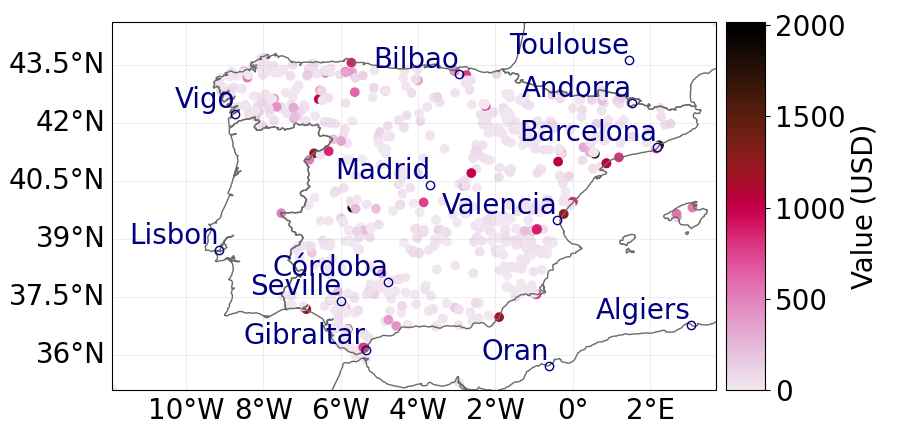

Introduction
----------------

Wildfire risk is rapidly increasing globally, leading to dramatic
impacts on ecosystems, biodiversity and society. Economic damages
threaten individual households, insurance companies and governmental
authorities alike. Over the past few years, (re-)insurance firms and
government agencies announced record losses due to wildfire hazards
(Swiss Re, 2019). While insured losses due to wildfire accounted for
less than 2% of total insured losses during the period from 1985 to
2015, this number is up to 12.4% for the period from 2016 to 2020
:cite:`Climada_paper`.

In Europe, wildfires pose a substantial concern, with the European Union
alone experiencing extensive land burning in recent years: 4,000
km\ :math:`^2` in 2019, 3,400 km\ :math:`^2` in 2020, and 5,000
km\ :math:`^2` in 2021. The level of risk associated with wildfires
varies greatly depending on the proximity to populated areas, the
characteristics of ecosystems, and the exposure of valuable assets in
vulnerable regions. Multiple factors contribute to the exacerbation or
mitigation of the risk, making it challenging to predict their complex
interactions. Moreover, the natural variability of climate,
environmental conditions, and human factors further complicates the
issue :cite:`DDHAD`.

The wildfire risk assessment methodology is still in its early stages,
particularly when compared to other natural catastrophes like
earthquakes, tropical cyclones, or flooding. This disparity can be
attributed to the significant influence of the human factor on most
wildfires, which sets them apart from other hazards. As a result,
developing comprehensive and robust wildfire risk assessment methods
remains a challenging task.

.. _hazard_section:

Hazard module
-----------------------

Wildfire risk indicators
==============================

Wildfire is considered one of the most challenging hazards to model. In
the standard probabilistic approach for physical risk assessment, we
estimate the probability of different intensity hazard events and then
use the vulnerability component to translate this intensity into
potential damage. The probabilistic approach primarily revolves around
working with return period maps of flood events, which offer information
about the likelihood of an event of a specific intensity occurring at
various locations on a map.

However, when it comes to wildfires, a major challenge arises due to the
significant human component in their origin. Available data reveals that
only 4% of recorded fires are attributed to causes unrelated to human
activities, with the majority caused by lightning. In contrast, a
substantial 96% of fires are associated with human activities, often
resulting from negligence or accidents. Furthermore, the intensity of
the fire is strongly influenced by the actions taken to fight it, which
can significantly reduce its intensity, duration, and potential damage.
This implies that the standard statistical methods of extreme value
theory typically used to create return period maps cannot be applied in
this context.

Despite these challenges, it does not imply that wildfire risk
assessment cannot be conducted on any level. In fact, two common
intensity indicators are often employed for this purpose: the fire
weather index and the brightness of the ground. In the following
subsections, we will delve into both of these measures and the datasets
associated with them.

Fire weather index (FWI) system 
=======================================

The fire weather index is a measure that assesses fire intensity by
taking into account both the rate of fire spread and the amount of fuel
being consumed. This index is calculated using the Canadian Forest
Service Fire Weather Index rating system (FWI). The Canadian Forest Fire
Weather Index (FWI) System consists of several elements that offer
insights into the relative potential for wildland fire, taking into
account fuel moisture and weather conditions. We provide the description
of the components after :cite:`CanFWI`.

-  | Fine Fuel Moisture Code (FFMC)
   | It describes the mositure content of litter and other cured fine
     fuels and it is an indicator of the ease of ignition and
     flammability of fine fuel.

-  | Duff Moisture Code (DMC)
   | It describes the average moisture content of loosely compacted
     organic layers of moderate depth and it is an indicator of fuel
     consumption in moderate duff layers and medium-size woody material.

-  | Drought Code (DC)
   | It describes the average moisture content of deep, compact organic
     layers and it is an indicator of seasonal drought effects on forest
     fuels and the amount of smoldering in deep duff layers and large
     logs.

   From the above three components we can build the following two:

-  | Initial Spread Index (ISI)
   | It quantifies the expected rate of fire spread and is based on wind
     speed and FFMC.

-  | Buildup Index (BI)
   | It quantifies the total amount of fuel available for combustion and
     it is based on the DMC and the DC.

Finally, the Fire Weather Index (FWI) is a comprehensive component that
combines the Initial Spread Index (ISI) and the Buildup Index (BUI) to
provide a unified numerical rating of the relative fire potential. It
takes into account the total fuel available for consumption and
dynamically integrates information from local meteorological variables
including temperature, wind speed, relative humidity, and precipitation.
A higher FWI value indicates more favorable meteorological conditions
for initiating a wildfire :cite:`DDHAD`.

It is important to note that the Fire Weather Index (FWI) is not a
conventional measure of hazard intensity. It solely indicates the
favorable conditions for fire spread and sustainability, rather than
providing information about the actual intensity of a fire event that
occurred. Furthermore, the FWI does not consider the significant
influence of the human factor, which plays a critical role in fire
ignition.

Wildfire brightness
=======================

Satellite remote sensing plays a crucial role in the detection of
wildfires, with methods leveraging brightness and temperature
differences (in Kelvin [K]) in remote sensing images to determine fire
occurrences being a primary focus in forest fire monitoring research.

Fire brightness refers to the radiant energy emitted by a fire,
typically measured using infrared radiation. Satellites equipped with
infrared sensors enable the detection and measurement of fire
brightness, facilitating the monitoring and assessment of fire activity
from space. Fire brightness offers valuable insights into the size,
intensity, and behavior of fires. By analyzing the infrared signals
captured by satellites, scientists and fire management agencies can
estimate a fire’s temperature and heat output, which serve as indicators
of its intensity. Brighter and hotter areas observed in satellite
imagery correspond to more active and intense burning.

The detection of wildfires often employs the change detection method,
which identifies pixels in images that have undergone changes compared
to previous images. Various environmental factors can cause changes in
different aspects of pixels. By setting a threshold value, areas of
"change" and "no change" can be identified in the image. In this method,
fire detection is performed on pixels exhibiting significant changes in
brightness temperature over time, identified through a preliminary
classification based on change detection. Pixels classified as "no
change" are considered non-fire pixels, even if they exhibit high
temperatures, such as hot desert pixels.

The dataset example containing information about fires in the Galicia
region of Spain in 2021, derived from satellite observations, is
illustrated in Figure `1 <fig:hazard_int_fire_>`_. The map displays the
maximum annual fire intensity observed at each point of the region in
2021. In areas where no fires occurred (non-fire or "no change" pixels),
the assigned brightness value is zero.

.. _fig:hazard_int_fire:

   Maximum annual intensity of wildfires in the Galicia region of Spain
   in 2021. The intensity is given in terms of ground brightness
   measured in Kelvins.

Data sources 
==================

The availability of wildfire data in both probabilistic and event-based
approaches remains a significant challenge, especially considering the
predominantly human factor-driven nature of most fire events. However,
there are some useful datasets that provide information about wildfire
intensity. These datasets include:

-  | The European Forest Fire Information System (EFFIS) offers the
     latest and most comprehensive information on the ongoing fire
     season in Europe and the Mediterranean area. This includes current
     meteorological fire danger maps and forecasts up to 6 days, along
     with daily updated maps of hot spots and fire perimeters. Access to
     the complete dataset can be obtained via the following link:
   | `https://effis.jrc.ec.europa.eu <https://effis.jrc.ec.europa.eu/apps/effis_current_situation/>`__
   | The comprehensive methodology for this tool can be found in:
   | `https://effis-gwis-cms.s3-eu-west-1.amazonaws.com/apps/fire.risk.viewer <https://effis-gwis-cms.s3-eu-west-1.amazonaws.com/apps/fire.risk.viewer/effis.fire.risk.viewer.user.guide.pdf>`__.

-  | Moderate Resolution Imaging Spectroradiometer (MODIS) provides a
     satellite-based sensor system widely utilized for monitoring
     thermal anomalies and fire activity on Earth. MODIS delivers
     valuable data and imagery that aid in fire detection, tracking, and
     analysis, including associated thermal anomalies. The MODIS sensor
     is capable of detecting flaming and smoldering fires as small as
     1000 m\ :math:`^2`, and under optimal observation conditions, fires
     as small as 50 m\ :math:`^2` can also be detected (Giglio et al.,
     2020). The nominal size of a MODIS pixel is approximately 1
     kilometer (km) in both the horizontal and vertical dimensions. The
     data can be downloaded via the following link:
   | `https://firms.modaps.eosdis.nasa.gov <https://firms.modaps.eosdis.nasa.gov/download/>`__.

-  | The World Bank provides low-resolution global return period maps
     for the Fire Weather Index (FWI) for 2, 10, and 30-year return
     periods. One can access the data using the following link:
   | `https://www.geonode-gfdrrlab.org <https://www.geonode-gfdrrlab.org/layers/hazard:csiro_wf_max_fwi_rp10>`__

Exposure module 
================

Exposure refers to the collection of assets that are susceptible to
potential hazards. The exposure model encompasses data regarding the
assets, properties, and infrastructure, along with their vulnerability
to potential risks. This information serves as a vital input for the
catastrophe model. In practical applications, an exposure database
typically includes the following information:

-  Type of assets (e.g., buildings, infrastructure, agriculture,
   machines, etc.)

-  Location of assets (usually specified in terms of latitude and
   longitude)

-  Value of the assets

The complexity of the exposure component varies depending on the
specific use case. When conducting risk assessment on a macroeconomic
level, such as for a country or region, estimating exposure can be
challenging due to the need for a comprehensive information about
economic properties and services. However, when assessing a portfolio of
assets for a company or bank, the exposure part typically presents fewer
difficulties. It comes from the fact that companies generally possess
detailed information about their assets, which serves as a primary input
for our climate risk model.

.. _secvulner:

Vulnerability module
---------------------------

The vulnerability module introduces the concept of damage functions,
which quantify the impact of hazard intensity on a specific asset
:cite:`Mitchel`. In this section, we will consider fire
brightness temperature as a proxy for hazard intensity. Figure
`2 <wildfire_damage_>`_ displays a damage function for assets
exposed to fires, sourced from :cite:`Climada_paper`, which
translates fire brightness into damage. For various natural hazards,
impact functions often exhibit a sigmoid shape. In this example, the
commonly used idealized function has been employed:

.. math:: f(i) = \frac{i^3}{1+i^3}

where i represents the intensity at a specific location, defined as:

.. math:: i_{lat, lon} = \frac{ \max[I_{lat,lon},0]  }{ I_{half}- I_{thresh}}.

Here, :math:`I_{lat,lon}` denotes the intensity of a fire at a specific
grid point. :math:`I_{thresh}` is the minimum intensity where damages
occur (chosen as a constant 295K, representing the minimum value of a
FIRMS data point to be displayed as a fire). The only parameter that
undergoes calibration is :math:`I_{half}`, which can be seen as the
steepness of the sigmoid function. As fire brightness increases, the
damage also rises, reaching about 50% for 400K
:cite:`Climada_paper`.

We emphasize that the damage function shown in Figure
`2 <wildfire_damage_>`_ is the only one we have found in the
literature so far, which links fire brightness to asset damage. It is a
universal function, meaning it is not specific to any particular group
of assets.

.. _wildfire_damage:

   The plots illustrate the correlation between fire intensity and the
   corresponding damage factor, ranging from 0% to 100%. The intensity
   (fire brightness temperature) is measured in Kelvin degrees. The blue
   horizontal line is an internal parameter of CLIMADA that is not
   relevant for us in this example.

Example: Wildfire damage for power plants in Spain
----------------------------------------------------------

Based on the discussions in section `2 <hazard_section_>`_, return
period maps for fire intensity measured in terms of brightness might not
provide relevant information about possible future events, making risk
assessment in this approach challenging. Instead, we will demonstrate
how wildfire data from past events can be utilized to estimate the
historical damage caused by wildfires.

The entire process will be executed using the open-source platform
CLIMADA, but one can also utilize other similar open-source or
commercial tools of this kind (see for instance OS-climate platform).
The documentation related to the CLIMADA platform can be found here:
`https://climada-python.readthedocs <https://climada-python.readthedocs.io/en/stable/>`__.

CLIMADA, short for CLIMate ADAptation, is a probabilistic natural
catastrophe impact model created and primarily managed by the Weather
and Climate Risks Group at ETH Zürich. This model offers a sophisticated
software tool tailored to evaluate and analyze climate-related risks and
their consequences for a range of hazards, including floods, storms,
heatwaves, and droughts. Its scope extends to various sectors,
encompassing infrastructure, agriculture, and human populations. By
seamlessly integrating cutting-edge climate models, geospatial data, and
statistical techniques, the CLIMADA platform effectively simulates and
visually portrays the potential impacts of climate events.

Hazard 
============

CLIMADA offers a Python class called "WildFire" designed specifically
for handling wildfire events. This class enables the modeling of
wildfire hazards using available historical data and generating
synthetic fires, which are then aggregated into event years for a
comprehensive probabilistic risk assessment. The historical data
utilized is sourced from the Fire Information for Resource Management
System (FIRMS). This system collects temperature data from various
satellite instruments, including:

-  Moderate Resolution Imaging Spectroradiometer (MODIS): Near real time
   or standard quality data with 1 km resolution. Data available from
   November 2000 to present.

-  Visible Infrared Imaging Radiometer Suite (VIIRS): Near real time
   data with 0.375 km resolution. Data available from 20 January 2012 to
   present.

The data can be obtained at
https://firms.modaps.eosdis.nasa.gov/download/ and saved as .csv file.

By utilizing the WildFire python class in the CLIMADA platform, we can
generate a map visualizing the wildfire intensity datasets. Figure
`3 <intensity_climada_fire_>`_ illustrates the wildfires intensity for the
year 2022, sourced from the FIRMS. The intensity is measured as the
brightness of the ground and is presented in Kelvin degrees. The map
shows the maximum fire brightness measured at each point in 2022.

.. _intensity_climada_fire:

   The wildfire intensity in Spain in 2022 represented in terms of a
   maximal ground brightness measured at each point.

Exposure
=====================

As an example of the asset portfolio in the exposure part, we utilized
the dataset from the Global Power Plant Database, a global and
open-source database of power plants. The dataset includes a set of
power plants in Spain and is accessible at
`https://datasets.wri.org <https://datasets.wri.org/dataset/globalpowerplantdatabase>`__.
The value of each power plant was determined based on its maximum energy
production capacity, measured in MWh. For the sake of simplicity, we
assumed a market value of one US dollar per MWh. It’s important to note
that this value is purely illustrative and not representative of the
actual energy production value. Thus, the value assigned to each power
plant is the value of its maximum energy production capacity. CLIMADA
provides a tool to create a map representation of the exposure dataset,
and its effect can be seen in Figure `4 <powerplants_exp_fire_>`_. The
geographical longitude and latitude provide the location of the power
plants.

.. _powerplants_exp_fire:

   Power plants in Spain, with the energy production serving as a proxy
   for the power plant’s value. The value in USD does not correspond to
   the actual energy production value but is used to illustrate the
   differences in energy production between the power plants in the
   dataset.

Vulnerability 
=====================

Next, we proceeded to the vulnerability module, aiming to convert the
intensity of the fire into the damage incurred on the power plants. The
damage function utilized in this step is a built-in damage function of
CLIMADA and its precise construction is described in
:cite:`Climada_paper`. For a general discussion of this
damage function see `4 <secvulner_>`_.

Subsequently, we employ the damage function `2 <wildfire_damage_>`_
to assess the impact of events from Figure `3 <intensity_climada_fire_>`_ on
our exposure. To calculate the damage value to a set of assets, we
multiply the value of each exposed asset in a grid cell by the Mean
Damage Ratio corresponding to the fire intensity in that grid cell.
Figure `5 <impact2_>`_ shows the impact of hazard events from 2022
on the exposure.

.. _impact2:

   Map illustrating the impact of fire hazard events from 2022 on the
   power plants in Spain.

Bibliography
---------------------------------

.. bibliography:: ../references.bib