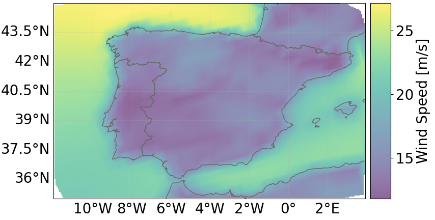
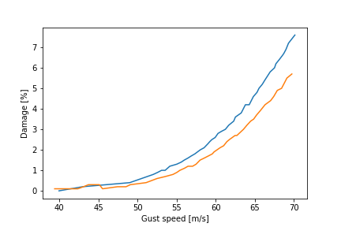
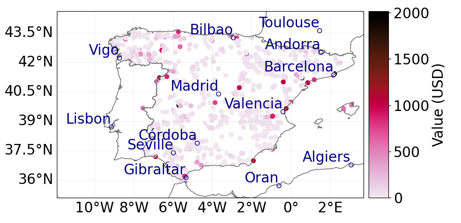
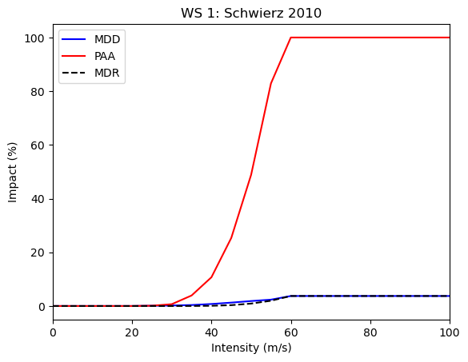
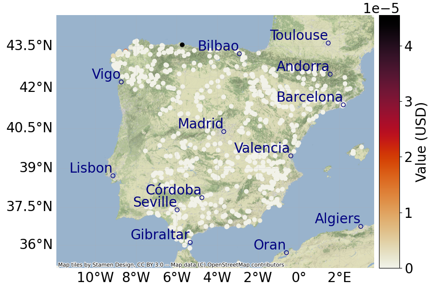

Introduction 
-------------------

The impact of windstorms on the European economy is evident from
historical records of wind events. In 2015, the estimated average annual
loss due to windstorms for the EU and UK was approximately €5 billion
(in 2015 values), representing about 0.04% of the total GDP of these
regions in that year. The damages affected various sectors, including
roads, power plants, agriculture, forests, infrastructure, and private
properties. Each year, around 16 million citizens in the EU and UK are
exposed to windstorms with an intensity that occurs only once every 30
years in the present climate, resulting in nearly 80 annual deaths.

Looking ahead, windstorm losses are projected to increase by 2050,
reaching nearly €7 billion per year (in 2015 values) under both 1.5C and
2C global warming scenarios. By the end of this century, these losses
are expected to surpass €11 billion per year, with slightly higher
impacts for higher levels of warming :cite:`JRC-windstorms`.

These compelling facts underscore the importance of employing
sophisticated and comprehensive risk assessment methods and tools to
address these events effectively. In this document, we will present a
methodology specifically tailored to windstorm events. Instead of
creating new methods, we will leverage well-established tools from
catastrophe modeling to achieve our objectives.

Let us recall that physical climate risk models typically comprise three
main components: a hazard module, an exposure module, and a
vulnerability module. This model structure is widely acknowledged in the
literature, and windstorm events are no exception.

The hazard module includes details about the specific windstorm hazards
we wish to include in our model, along with their essential
characteristics. In this case, it will contain specific information
about windstorm events, which we will further discuss. It’s essential to
note that the hazard module does not refer to any group of assets at
this stage; instead, it focuses solely on the hazard events themselves.
The exposure component consists of information about the assets,
including their descriptions and specific locations. Lastly, the
vulnerability component acts as a link between the hazard, exposure, and
potential loss, enabling the estimation of relative damage to an asset
based on a specific windstorm hazard level. The essence of the
vulnerability model lies in the employment of damage functions, which
convert windstorm intensity into an estimated damage ratio relative to
the total value of the asset.

In the following sections, we will examine each of the above mentioned
components of the physical risk model in the context of windstorms,
illustrating how to carry out a comprehensive risk assessment for
windstorm events.

Hazard module 
----------------

What is a windstorm? 
=======================

A windstorm is a severe weather event characterized by strong and
damaging winds. Windstorms can occur in various forms and under
different meteorological conditions, but they typically involve
sustained high wind speeds that can cause significant impacts on
communities, infrastructure, and the environment. Wind speeds during a
windstorm typically exceed 55 km (34 miles) per hour. Wind damage can be
attributed to gusts (short bursts of high-speed winds) or longer periods
of stronger sustained winds. Windstorms may last for just a few minutes
when caused by downbursts from thunderstorms, or they may last for hours
(and even several days) when they result from large-scale weather
systems

Windstorm intensity indicators
===================================

Common metrics used to assess the intensity of windstorm hazards
include:

-  Wind speed - also known as sustained wind, refers to the average
   velocity of air movement over a specified duration at a particular
   height above the surface (often at 10 meters). It represents the
   overall strength or speed of the wind and is commonly expressed in
   units like miles per hour (mph) or kilometers per hour (km/h). For
   instance, if a weather report indicates a wind speed of 20 mph, it
   signifies that the average speed of the wind over the specified
   period, usually a few minutes, is 20 mph.

-  Wind gust - also referred to as a gust of wind or squall, represents
   a transient and rapid surge in wind speed above the prevailing wind
   speed at a specified height above the surface (usually 10m). It is a
   brief occurrence characterized by a sudden and intense burst of
   stronger winds. Wind gusts typically endure for a few seconds to a
   minute or two.

-  The Storm Severity Index (SSI) - it can be defined in various ways
   depending on the context. In the case of a specific grid cell within
   the footprint, the SSI is calculated using the formula:

   .. math:: SSI = V^3\cdot A\cdot D

   Here, :math:`V` represents the maximum surface wind speed, :math:`A`
   represents the grid box area and :math:`D` represents the duration of
   the storm (see
   :cite:`oxf`, :cite:`SyntheticEventStorm`, :cite:`rmets_online`).

Windstorm datasets
=======================

There are two main approaches to the risk assessment of catastrophe
events and in particular to windstorms. The first one, sometimes called
probabilistic one, is based on the estimation of the probability of
windstorm events of different intensity, with an aim of the subsequent
translation (via damage the vulnerability component) of this intensity
into the potential damage. In the second one, sometimes called the
"event-based", or deterministic approach one simulates thousands of
potential windstorm events and, subsequently estimates the windstorm
peril basing on the collection of these events. The creation of this
collection of events can be done using either climate models or the
stochastic analysis based on past historical events. In our approach we
will rely on the probabilistic approach and the rest of this document
will be entirely devoted to this way of thinking.

The choice of the method of the risk assessment implies the choice of
the datasets we want to rely on. In the event based approach the hazard
dataset consists of the collection of thousand of simulated events that
can subsequently be used in wind risk analysis. These datasets are often
presented in a form of event-loss tables. In the probabilistic approach,
the main datasets we work on are the so-called return period maps of
windstorm events. In a general sense, the return period map provides
information about the likelihood of the occurence of the windstorm event
of a given intensity in every location on a map.

The example of the return period map for a 5-year return period is given
on a figure `1 <wind_intensity_>`_.

.. _wind_intensity:

   5-year return level of winter half-year (October – March) daily
   maximum 10m wind speeds estimated for the present day climate
   (1970-2000) by using a multi-model ensemble of 29 CORDEX regional
   model simulations.

The interpretation of the map is as follows: For each point
:math:`(x,y)` on the map, if the intensity value is :math:`I`, it
indicates that, statistically, every 5 years, there will be at least one
winter where the maximum daily wind speed will exceed :math:`I`. The
dataset was generated using a multi-model ensemble of 29 CORDEX regional
model simulations.

Some examples of data providers for various windstorm hazard datasets
include:

-  https://data.4tu.nl/

-  http://www.europeanwindstorms.org/

-  `Windstorm Information
   Service <https://climate.copernicus.eu/windstorm-information-service>`__

-  `European Centre for Medium-Range Weather
   Forecasts <https://www.ecmwf.int/en/forecasts/dataset/ecmwf-reanalysis-40-years>`__

Exposure module
---------------------------

Exposure in the context of risk assessment encompasses a collection of
assets that could be potentially affected by hazards. The exposure model
entails data related to assets, properties, and infrastructure, along
with their vulnerability to various risks. This essential information
acts as a key input for the catastrophe model. In real-world
applications, an exposure database typically includes the details such
as the type of assets (e.g., buildings, infrastructure, agriculture,
machinery, etc.), location (usually specified in terms of latitude and
longitude) or value of the assets.

The complexity of the exposure component varies depending on the
specific use case. Conducting risk assessment on a macroeconomic level,
such as for a country or region, can be challenging due to the need for
comprehensive information about economic properties and services.
However, when assessing a portfolio of assets for a company or bank, the
exposure part usually presents fewer difficulties. This is because
companies generally possess detailed information about their assets,
which serves as a primary input for our climate risk model.

Vulnerability module 
------------------------------

| To estimate direct windstorm damage, wind speed curves are commonly
  employed. These curves provide information on the expected windstorm
  damage for specific wind speeds, categorized by assets or land-use
  classes. Figure `2 <damage_funs_wind2_>`_ illustrates two damage
  functions for residential buildings in Germany exposed to windstorms,
  sourced from
| `https://www.semanticscholar <https://www.semanticscholar.org/paper/Storm-damage-risk-assessment-in-Germany-Heneka-Ruck/16e364eb2058d6fb6c130d9a5077011cae2bc4e3>`__.

The plots illustrate how wind intensity (wind gust speed) is transformed
into potential damage for residential buildings. Each function
originates from a distinct model used in its construction. As observed,
the resulting damage slightly varies depending on the model, but they
all exhibit the same pattern, wherein damage increases with higher wind
speeds.

It is important to stress, that the relationship between wind speed and
damage is intricate and lacks extensive experimental evidence,
particularly at higher intensities. Complicating matters further, the
wide regional diversity of building structures worldwide hampers a
globally standardized comparison of severe convective wind phenomena.
Moreover, determining wind speeds in severe convective weather phenomena
such as tornadoes or downbursts poses a significant challenge due to
their localized and short-lived nature. As a result, these events are
often not captured by standard meteorological station networks. Even if
they were recorded, the devices used for measurement can be destroyed or
provide inaccurate data as the wind speeds frequently exceed their
designed range. In some instances, remote sensing by mobile radar
systems, like the Doppler-OnWheels (DOW), has been successful in
measuring wind profiles of tornadoes, but these systems face
difficulties observing regions close to the ground, and their successful
deployment is rare compared to the occurrence of tornadoes and
downbursts. Consequently, estimates of wind speed are typically derived
ex post based on the resulting damage caused by these events
:cite:`FGD`.

.. _damage_funs_wind2:

   The plots illustrate how wind gust speed is translated into damage
   for residential buildings. The curves were obtained from two
   different models used in their construction.

Impact assessment 
---------------------

After collecting all the necessary components of hazard, exposure, and
vulnerability, we proceed with the most important part, which is risk
assessment. We usually follow these steps: First, we use the return
period maps to determine the wind intensity associated with each
location of the area of interest. Next, we map the wind intensities data
onto the exposure map to identify the specific wind hazard level that
each asset faces. Then, we estimate the potential damage to each asset
by applying the appropriate damage function, which quantifies the
relationship between wind intensity and asset vulnerability. By
utilizing these functions, we can calculate the expected level of damage
or loss for each asset based on the corresponding wind intensity.

Once the asset damage estimates are obtained, we aggregate and analyze
the results to gain an overall assessment of the risk. This involves
summarizing the estimated damages for all exposed assets, calculating
the total expected losses, and identifying areas or assets that are at
higher risk. The final output of the risk assessment is usually provided
in a form of risk metrics that provide information about the risk
related to the portfolio of assets. Common metrics include
:cite:`Mitchel`:

-  The annual expected loss (AEL).

-  | Standard deviation (SD) around the AAL
   | SD is a measure of the volatility of loss around the AAL.

-  | Occurrence Exceedance Probability (OEP).
   | OEP is the probability that the maximum event loss in a year
     exceeds a given level.

-  | Aggregate Exceedance Probability (AEP).
   | AEP is the probability that the sum of event losses in a year
     exceeds a given level.

-  | Value at risk (VaR).
   | VaR is the loss value at a specific quantile of the relevant loss
     distribution.

Additionally, by considering factors such as asset valuation,
replacement costs, business interruption losses, and indirect expenses,
a more comprehensive estimation of the financial impact can be achieved.

Example - Windstorm risk assessment for powerplants in Spain 
-------------------------------------------------------------------

In this section, we will provide a concise demonstration of how to
conduct a risk assessment for wind events, using power plants in Spain
as an example. The entire process will be carried out using the
open-source platform CLIMADA, but there are alternative open-source or
commercial tools available, such as the OS-climate platform. Detailed
documentation for the CLIMADA platform can be accessed here:
`https://climada-python.readthedocs <https://climada-python.readthedocs.io/en/stable/>`__.

CLIMADA, short for CLIMate ADAptation, is a probabilistic natural
catastrophe impact model primarily developed and maintained by the
Weather and Climate Risks Group at ETH Zürich. This software tool offers
a comprehensive solution for assessing and analyzing climate-related
risks and their potential consequences across various hazards, including
floods, windstorms, heatwaves, and droughts. The platform’s versatility
extends to evaluating impacts on different sectors, such as
infrastructure, agriculture, and human populations. By incorporating
advanced climate models, geospatial data, and statistical methods,
CLIMADA enables the simulation and visualization of potential climate
event impacts with high accuracy and efficiency.

Hazard 
=====================

Since CLIMADA does not have a built-in Windstorm python class, we
developed one ourselves, defining parameters like wind intensity,
fraction, and coordinates.

For our example, we utilized windstorm hazard maps prepared by
4TU.ResearchData, which is led by the 4TU.ResearchData Consortium
comprising Delft University of Technology, Eindhoven University of
Technology, University of Twente, and Wageningen University & Research.
The dataset contains present-day (1970-2000) return levels of daily
maximum 10m wind speeds based on a multi-model ensemble of EURO-CORDEX
simulations for the European region. The data is available for download
from the 4TU Data Catalog for four different return periods: 5, 10, 20,
and 50 years, with a map resolution of 45 km. The data can be accessed
through the following link:
`https://data.4tu.nl <https://data.4tu.nl/articles/dataset/Pan-European_data_sets_of_windstorm_probability_of_occurrence_in_present_and_future_climate/12719387/1>`__.

.. _intensity_climada_wind:

   The wind intensity in Spain represented in terms of a wind speed (in
   meters per second) for a 5-year return period taken from
   4TU.ResearchData Consortium.

The visualization of the dataset by CLIMADA for a 5-year return period
is shown in Figure `3 <intensity_climada_wind_>`_.

Exposure
=============

As an example of the asset portfolio in the exposure part, we utilized
the dataset from the Global Power Plant Database, a global and
open-source database of power plants. The dataset includes a set of
power plants in Spain and is accessible at
`https://datasets.wri.org <https://datasets.wri.org/dataset/globalpowerplantdatabase>`__.
The value of each power plant was determined based on its maximum energy
production capacity, measured in MWh. For the sake of simplicity, we
assumed a market value of one US dollar per MWh. It’s important to note
that this value is purely illustrative and not representative of the
actual energy production value. Thus, the value assigned to each power
plant is the value of its maximum energy production capacity. CLIMADA
provides a tool to create a map representation of the exposure dataset,
and its effect can be seen in Figure `4 <powerplants_exp_wind_>`_. The
geographical longitude and latitude provide the location of the power
plants.

.. _powerplants_exp_wind:

   Power plants in Spain, with the energy production capacity value
   serving as a proxy for the power plant’s value. The value in USD does
   not correspond to the actual energy production value but is used to
   illustrate the differences in energy production between the power
   plants in the dataset.

Vulnerability
===================

Next, we proceeded to the vulnerability module, aiming to convert the
intensity of the windstorm into the damage incurred on the power plants.
The damage function utilized in this step is a default damage function
from CLIMADA.

.. _fig:damage2_wind:

   The plots demonstrate the conversion of wind speed into a damage
   factor ranging from 0% to 100%. Here, MDD represents the mean damage
   (impact) degree, PAA denotes the percentage of affected assets, and
   MDR is the mean damage ratio calculated as MDR =
   MDD\ :math:`\cdot`\ PAA.

The plots demonstrate how wind intensity (wind speed) is translated into
potential damage. The blue curve represents the mean damage ratio (MDR),
which shows the fraction (0%-100%) of the total asset value lost due to
the windstorm event. The red line indicates the percentage of affected
assets (PAA), and it is an internal parameter of CLIMADA that is not
relevant for us in this example.

The figure `6 <impact2_wind_>`_ shows the annual expected impact map. As
shown, the damage for all assets is nearly zero, which can be attributed
to two reasons. Firstly, the wind intensities depicted in figure
`3 <intensity_climada_wind_>`_ are relatively small in the Spain region,
with values not exceeding 20 m/s in most locations. Secondly, the damage
function exhibits a relatively flat behavior for wind speeds up to 40
m/s.

.. _impact2_wind:

   The map represents the annual expected impact on power plants in
   Spain due to windstorm events. The nearly zero impact is a result of
   the region’s relatively low wind intensities, which correspond to low
   damage factors associated with those intensities.

Bibliography
---------------------------------

.. bibliography:: ../references.bib
