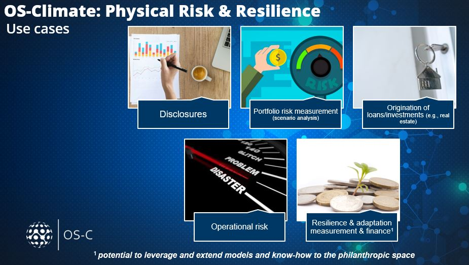
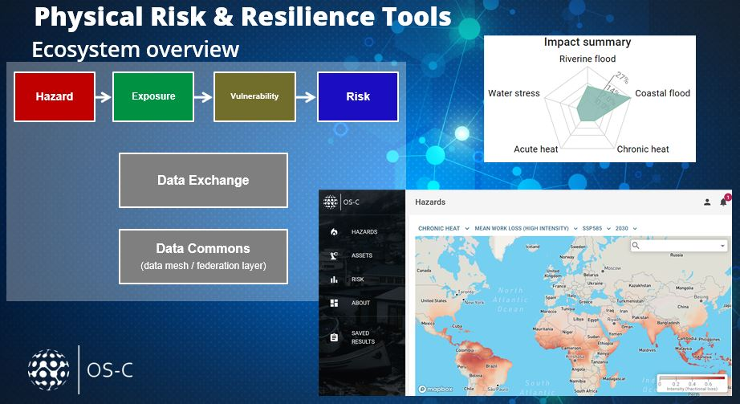
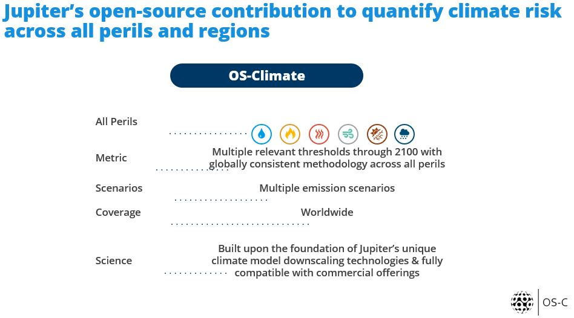
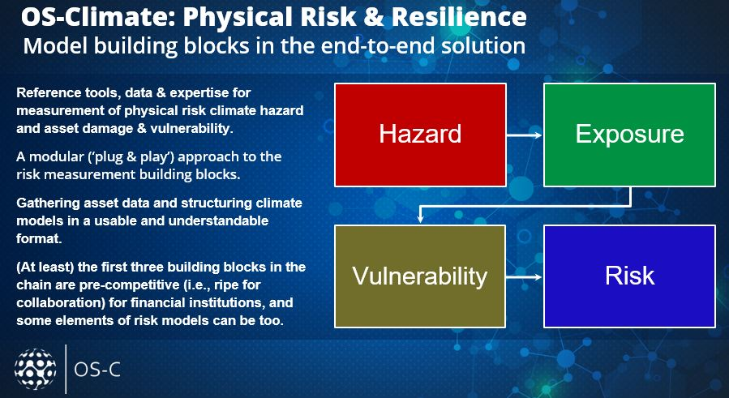
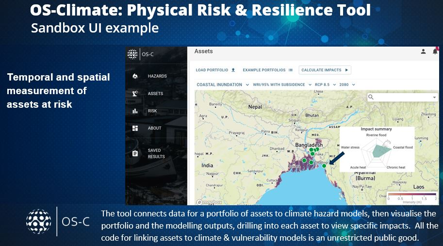
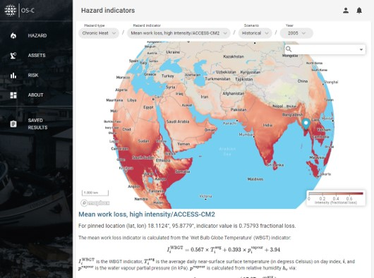
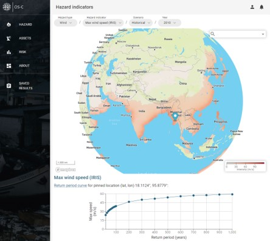

Welcome to PhysicalRisk's documentation!
========================================

This website contains the documentation related to the Physical Risk engine of OS-Climate.

Please, visit the `official webpage! <https://os-climate.org/physical-risk-resilience/>`_

.. _cards-clickable:

..
  list with all the possible icons for the grid 
  https://sphinx-design.readthedocs.io/en/latest/badges_buttons.html

.. raw:: html

   

.. grid:: 2
    :gutter: 1

    .. grid-item-card::  Getting started
      :link: getting-started.html
      :text-align: center

      :octicon:`location;5em;sd-text-info`
      ^^^

    .. grid-item-card::  Code documentation
      :link: physrisk.html
      :text-align: center

      :octicon:`code;5em;sd-text-info`
      ^^^

.. grid:: 2
    :gutter: 1

    .. grid-item-card::  Commands
      :link: commands.html
      :text-align: center

      :octicon:`terminal;5em;sd-text-info`
      ^^^

    .. grid-item-card::  Onboarding
      :link: handbook/onboarding.html
      :text-align: center

      :octicon:`upload;5em;sd-text-info`
      ^^^
      See `Contributing <https://github.com/os-climate/physrisk/blob/main/CONTRIBUTING.md>`_

.. grid:: 2
    :gutter: 1

    .. grid-item-card::  methodology
      :link: methodology.html
      :text-align: center

      :octicon:`book;5em;sd-text-info`
      ^^^

    .. grid-item-card::  hazards
      :link: hazards.html
      :text-align: center

      :octicon:`flame;5em;sd-text-info`
      ^^^

Physical Risk and Resilience
=============================

|

|

|

|

|

|

|

Contents
==========

.. toctree::
   :maxdepth: 2

   getting-started
   physrisk
   commands
   handbook/onboarding
   Methodology <methodology>
   hazards

Indices and tables
==================

* :ref:`genindex`
* :ref:`modindex`
* :ref:`search`
